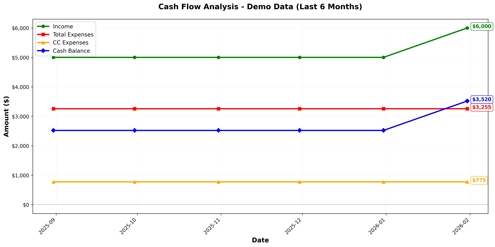

# Monarch Money Custom Budgeting Analysis

A Python-based budgeting analysis tool for Monarch Money with enhanced credit card debt tracking and payoff analysis.

> **Note**: This is an unofficial tool using the unofficial Monarch Money API. It is not endorsed by Monarch Money and may break at any time. Use at your own risk.

## Why This Tool?

Monarch Money is great, but tracking credit card debt payoff can be tricky. This tool helps you:

- **Distinguish debt payoff from spending**: See how much you're actually paying down vs. new purchases
- **Track multiple cards**: Monitor progress across all your credit cards
- **Get accurate insights**: Separate debt reduction from regular spending in your budget analysis
- **Keep it local**: All your financial data stays on your machine

## Features

✅ Credit card account identification and tracking
✅ Transaction categorization (purchases vs. payments)
✅ Debt payoff progress calculation
✅ **Cash flow analysis over time** - Track income, total expenses, CC expenses, and cash balance
✅ **Visualization** - Beautiful plots showing your financial trends
✅ **Summary statistics** - Average monthly metrics and totals
✅ **Cash-based budget view** - See TRUE CASH REMAINING (income - cash expenses - CC payments)
✅ **Budget forecast** - Project expected end-of-month cash based on budget
✅ **PDF reports** - Generate professional PDF reports with charts
✅ **Debt payoff projections** - See how fast you can pay off CC debt and loans at different allocation rates
✅ **Custom budget overrides** - Use a local JSON file to override Monarch budgets
✅ **Streamlit Budget Editor** - Interactive web UI for editing budget categories with live forecast preview
✅ Text-based reporting with Rich terminal tables

## Installation

### Prerequisites

- Python 3.8 or higher
- A Monarch Money account

### Setup

1. **Clone the repository**:
   ```bash
   git clone https://github.com/HxCory/monarch-money-api-cg.git
   cd monarch-money-api-cg
   ```

2. **Create a virtual environment** (recommended):
   ```bash
   python -m venv venv
   source venv/bin/activate  # On Windows: venv\Scripts\activate
   ```

3. **Install dependencies**:
   ```bash
   pip install -r requirements.txt
   ```

4. **Fix gql compatibility** (if needed):

   The `monarchmoney` library may have issues with `gql>=4.0`. If you see GraphQL errors, downgrade:
   ```bash
   pip install 'gql<4.0'
   ```

## Configuration

### Authentication

You have two options for authentication:

#### Option 1: Environment Variables

```bash
export MONARCH_EMAIL="your-email@example.com"
export MONARCH_PASSWORD="your-password"
```

#### Option 2: `.env` File (Recommended)

Create a `.env` file in the project root:

```env
MONARCH_EMAIL=your-email@example.com
MONARCH_PASSWORD=your-password
```

> **Security Note**: The `.env` file is in `.gitignore` and will never be committed. See [SECURITY.md](SECURITY.md) for more details.

### Multi-Factor Authentication (MFA/2FA)

If your Monarch Money account has MFA enabled, you have two options:

#### Option 1: Automatic TOTP (Recommended)

Set your TOTP secret key as an environment variable:

```bash
export MONARCH_MFA_SECRET="your-totp-secret-key"
```

This allows fully automated authentication without manual MFA code entry.

#### Option 2: Interactive Login

Use interactive login to authenticate manually:

```bash
source venv/bin/activate
python3 -c "from monarchmoney import MonarchMoney; import asyncio; mm = MonarchMoney(); asyncio.run(mm.interactive_login())"
```

This will prompt for:
1. Email
2. Password
3. MFA code (from your authenticator app)

The session is saved to `.mm/mm_session.pickle` and reused for future runs.

### Session Caching

After your first successful login, the `monarchmoney` library will save a session token in `.mm/`. You won't need to provide credentials again until the session expires!

### Configuration Files

For debt payoff projections and custom budgets, copy the example files:

```bash
cp debt_config.example.json debt_config.json
cp custom_budget.example.json custom_budget.json
```

Then edit with your actual values:
- **debt_config.json**: Interest rates, allocation percentages, loan category name
- **custom_budget.json**: Override Monarch budgets with local values

These files are gitignored to keep your personal data private.

## Usage

### Quick Start

**Option 1: Try the demo with test data** (no authentication required):

```bash
python demo_plot.py
```

This will:
1. Load realistic dummy data (6 months of transactions)
2. Calculate cash flow metrics
3. Generate a visualization showing income, expenses, CC expenses, and cash balance
4. Save a plot as `cash_flow_demo.png`

**Option 2: Run with your real Monarch Money data**:

```bash
python example.py
```

This will:
1. Login to your Monarch Money account
2. Fetch your accounts and 6 months of transactions
3. Analyze your credit card debt
4. Display a summary report
5. Generate time series visualizations in `output/analysis_YYYYMMDD_HHMMSS/`

**Option 3: Cash-Based Budget Analysis**:

```bash
python cash_budget.py                         # Previous month
python cash_budget.py --month 2025-12         # Specific month
python cash_budget.py --month 2025-12 --pdf   # Generate PDF report
```

Shows TRUE CASH REMAINING = Income - Cash Expenses - CC Payments

**Option 4: Budget Forecast**:

```bash
python budget_forecast.py                     # Current month
python budget_forecast.py --month 2026-01     # Specific month
python budget_forecast.py --month 2026-01 --pdf  # Generate PDF
python budget_forecast.py --use-local-budget  # Use custom_budget.json
```

Shows expected end-of-month cash based on your Monarch budget:
- Starting Cash + Expected Income - Expected Expenses = Expected End Cash

**Option 5: Debt Payoff Projections**:

```bash
python debt_payoff.py                         # CC debt, current month
python debt_payoff.py --type loan             # Loan debt
python debt_payoff.py --type cc --month 2026-01
python debt_payoff.py --use-local-budget      # Use custom_budget.json
```

Shows how quickly you can pay off debt at different allocation percentages (25%, 35%, 50%, 60%, 65%, 70%, 75%) of your monthly surplus:
- **Credit Cards**: 24% APR assumed
- **Loans**: 12.71% APR, uses "Loan Repayment" budget category as base payment

Generates payoff timeline plots saved to `output/`.

**Option 6: Budget Editor (Web UI)**:

```bash
streamlit run budget_editor.py
```

Opens a web browser with an interactive budget editor:
- Edit income and expense categories in a spreadsheet-like table
- Auto-calculated totals update as you type
- Select month from dropdown (supports past 12 months and next 3 months)
- Fetch live starting cash balance from Monarch Money API
- See forecast preview: Starting Cash + Income - Expenses = Expected End
- Save budgets per-month to `budgets/YYYY-MM.json`
- Copy budgets from previous months

> **Note**: Run a CLI tool first (e.g., `python budget_forecast.py`) to authenticate before using the web UI.

### Example Output

```
Monarch Money - Custom Budgeting Analysis
============================================================

Logging in to Monarch Money...
✓ Login successful

Fetching account data...
✓ Found 12 accounts
✓ Found 3 credit card accounts

Fetching transactions from 2025-01-01 to 2025-01-31...
✓ Found 145 transactions

============================================================
CREDIT CARD DEBT ANALYSIS REPORT
============================================================

Account Summary:
------------------------------------------------------------
  Chase Sapphire: $-1,245.67
  Capital One: $-850.32
  Discover: $-0.00

Total Credit Card Debt: $-2,095.99

Transaction Summary:
------------------------------------------------------------
  New Purchases: 42 transactions
  Payments: 3 transactions

  Total New Purchases: $1,892.45
  Total Payments: $2,500.00
============================================================
```

## Project Structure

```
monarch-money-api-cg/
├── monarch_budgeting/          # Main Python package
│   ├── __init__.py            # Package initialization
│   ├── client.py              # Monarch Money API client wrapper
│   ├── analyzer.py            # Credit card debt & cash budget analysis
│   ├── visualizer.py          # Visualization and plotting
│   ├── budget_data.py         # Budget data structures
│   ├── budget_display.py      # Rich terminal display
│   ├── budget_pdf.py          # PDF report generation
│   ├── utils.py               # Shared utilities
│   └── main.py                # Main CLI entry point
├── output/                    # Generated reports (gitignored)
│   ├── cash_budget_YYYYMM.pdf # Cash budget PDF reports
│   ├── budget_forecast_YYYY-MM.pdf  # Forecast PDF reports
│   └── cc_payoff_YYYY-MM.png  # Debt payoff projection plots
├── budgets/                   # Per-month budget files (gitignored)
│   └── 2026-01.json          # Budget for January 2026
├── budget_editor.py          # Streamlit web UI for editing budgets
├── cash_budget.py            # Cash-based budget CLI
├── budget_forecast.py        # Budget forecast CLI
├── debt_payoff.py            # Debt payoff projections CLI
├── debt_config.example.json  # Example config for debt payoff
├── custom_budget.example.json # Example custom budget override
├── example.py                # Credit card analysis example
├── demo_plot.py              # Demo with test data (no auth required)
├── requirements.txt           # Python dependencies
├── pyproject.toml            # Modern Python project configuration
├── SECURITY.md               # Security guidelines
├── CLAUDE.md                 # Project planning document
└── README.md                 # This file
```

## Cash Flow Visualization

The tool generates beautiful plots showing your financial trends over time:



The plot shows four key metrics:
- **Income (Green)**: Your total income per period
- **Total Expenses (Red)**: All your expenses
- **CC Expenses (Orange)**: Expenses charged to credit cards
- **Cash Balance (Blue)**: Income minus non-CC expenses

**Cash Balance Formula**: `Income - (Total Expenses - CC Expenses)`

This metric shows how much cash you're keeping after paying for everything that doesn't go on credit cards.

## Advanced Usage

### Using as a Library

```python
import asyncio
from monarch_budgeting.client import MonarchClient
from monarch_budgeting.analyzer import CreditCardAnalyzer
from monarch_budgeting.visualizer import BudgetVisualizer
from datetime import datetime, timedelta

async def analyze():
    # Initialize and login
    client = MonarchClient()
    await client.login(use_saved_session=True)

    # Fetch data
    accounts = await client.get_accounts()
    transactions = await client.get_transactions(
        start_date=datetime.now() - timedelta(days=30),
        end_date=datetime.now()
    )

    # Analyze
    analyzer = CreditCardAnalyzer(transactions, accounts)

    # Get credit card summary
    summary = analyzer.get_credit_card_summary()
    print(summary)

    # Calculate cash flow over time
    cash_flow = analyzer.calculate_cash_flow_over_time(
        start_date=datetime.now() - timedelta(days=180),
        end_date=datetime.now(),
        frequency='ME'  # Month end
    )
    print(cash_flow)

    # Create visualization
    visualizer = BudgetVisualizer()
    visualizer.plot_cash_flow(
        cash_flow_df=cash_flow,
        title="My Cash Flow Analysis",
        save_path="my_cash_flow.png"
    )

    # Get summary statistics
    stats = analyzer.calculate_monthly_summary()
    print(f"Average monthly income: ${stats['avg_monthly_income']:,.2f}")
    print(f"Average cash balance: ${stats['avg_cash_balance']:,.2f}")

asyncio.run(analyze())
```

### Running Tests

Run basic tests without authentication:

```bash
python test_basic.py
```

## Security

🔒 **Your credentials are safe!**

- Passwords never stored in code or logs
- Credentials only via environment variables or `.env` file
- Session tokens stored locally in `.mm/` (excluded from git)
- All financial data stays on your machine
- No third-party data sharing

See [SECURITY.md](SECURITY.md) for complete security guidelines.

## Development

### Contributing

This is a personal project, but contributions are welcome! If you have ideas for improvements:

1. Fork the repository
2. Create a feature branch
3. Make your changes
4. Submit a pull request

### Roadmap

- [x] Basic credit card debt analysis
- [x] Transaction categorization
- [x] CLI reporting
- [x] Monthly trend analysis
- [x] Cash flow visualization
- [x] Summary statistics
- [x] Time series visualizations (payments vs purchases, by card, cumulative debt)
- [x] Timestamped output directories
- [x] Cash-based budget view (TRUE CASH REMAINING)
- [x] Budget forecast (expected end-of-month cash)
- [x] PDF report generation
- [x] Category-level breakdowns
- [x] Debt payoff projections (CC and loans with configurable interest rates)
- [x] Custom budget overrides (local JSON files)
- [x] Streamlit budget editor (interactive web UI with forecast preview)
- [ ] Multi-month trend analysis
- [ ] Budget vs. actual comparisons

## Tech Stack

- **Python 3.8+**
- **[monarchmoney](https://github.com/hammem/monarchmoney)** - Python library for Monarch Money API
- **pandas** - Data processing and analysis
- **numpy** - Numerical computations
- **matplotlib** - PDF report generation and charts
- **rich** - Beautiful terminal output with tables and panels
- **streamlit** - Interactive web UI for budget editing

## Credits

This project uses the [monarchmoney](https://github.com/hammem/monarchmoney) Python library by @hammem for accessing the Monarch Money API.

This project was inspired by [pbassham/monarch-money-api](https://github.com/pbassham/monarch-money-api).

## License

MIT License - See [LICENSE](LICENSE) file for details.

## Disclaimer

This tool is provided "as is" without warranty of any kind. It uses an unofficial API that could break at any time. Users are responsible for:

- Securing their own credentials
- Reviewing code before running it
- Understanding the risks of using unofficial APIs
- Complying with Monarch Money's Terms of Service

Use at your own risk!

---

**Questions or issues?** Open an issue on GitHub or check the [claude.md](claude.md) file for project planning details.
